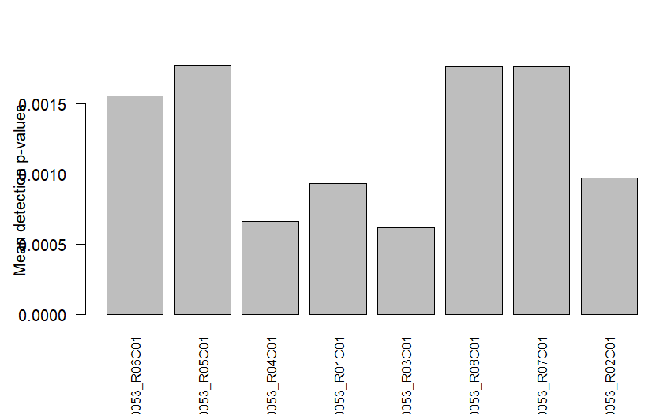
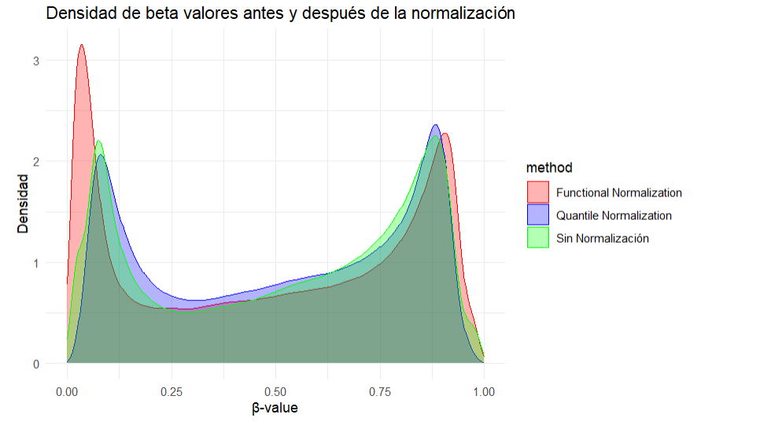

# R Activity Methylation

### Data set

https://www.ncbi.nlm.nih.gov/geo/query/acc.cgi?acc=GSE252130

### Update Data set

To use another dataset modify the line.
```R
dir_idat = "{idat_folder_path}"
``` 

Replace **{idat_folder_path}** with the path corresponding to the folder containing the IDAT files of the dataset.

Also modify the line 
```R
targets <- read.metharray.sheet(dir_idat, pattern="{sampleSheet_name}")
``` 
Replace **{sampleSheet_name}** with the name of the appropriate SampleSheet file, and make sure that the file is located in the same folder as the IDAT files.
### Results



